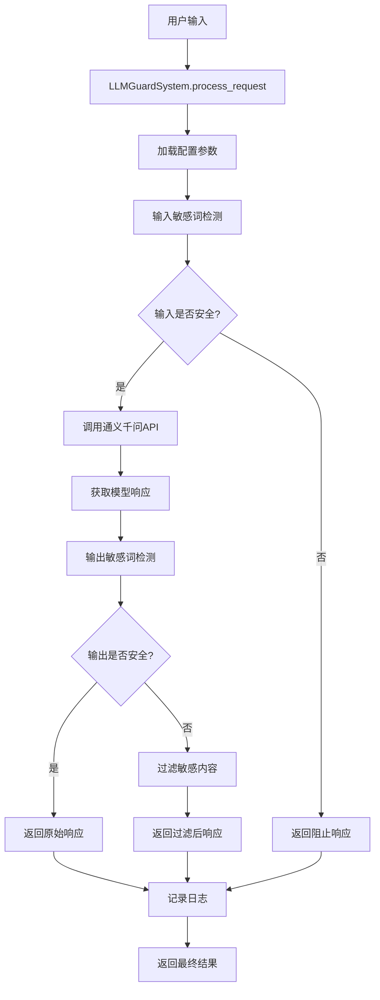

# LLM安全防护系统架构文档

## 📋 目录
1. [系统概述](#系统概述)
2. [架构设计](#架构设计)
3. [核心组件](#核心组件)
4. [工作流程](#工作流程)
5. [数据流向](#数据流向)
6. [安全机制](#安全机制)
7. [技术实现](#技术实现)

## 🎯 系统概述

### 设计目标
本系统旨在为LLM应用提供全面的安全防护，通过多层次的敏感词检测和内容过滤，确保AI模型的输入输出符合安全规范。

### 核心价值
- **安全第一**: 双重检查机制，确保内容安全
- **高性能**: 基于llm-guard优化的检测算法
- **易扩展**: 模块化设计，便于功能扩展
- **生产就绪**: 完整的监控、日志和错误处理

## 🏗️ 架构设计

### 整体架构图
```
┌─────────────────────────────────────────────────────────┐
│                    用户接口层                              │
├─────────────────────────────────────────────────────────┤
│  命令行接口  │  交互模式  │  API接口  │  演示程序          │
└─────────────────────────────────────────────────────────┘
                            │
┌─────────────────────────────────────────────────────────┐
│                    业务逻辑层                              │
├─────────────────────────────────────────────────────────┤
│              LLMGuardSystem (主控制器)                    │
│  ┌─────────────────┐  ┌─────────────────┐               │
│  │  请求处理器      │  │  配置管理器      │               │
│  └─────────────────┘  └─────────────────┘               │
└─────────────────────────────────────────────────────────┘
                            │
┌─────────────────────────────────────────────────────────┐
│                    安全防护层                              │
├─────────────────────────────────────────────────────────┤
│  ┌─────────────────┐  ┌─────────────────┐               │
│  │ 敏感词检测器     │  │ 安全LLM客户端   │               │
│  │ (输入检查)      │  │ (输出检查)      │               │
│  └─────────────────┘  └─────────────────┘               │
└─────────────────────────────────────────────────────────┘
                            │
┌─────────────────────────────────────────────────────────┐
│                    数据访问层                              │
├─────────────────────────────────────────────────────────┤
│  ┌─────────────────┐  ┌─────────────────┐               │
│  │ LLM API客户端   │  │ 敏感词数据库     │               │
│  │ (通义千问)      │  │ (21930词汇)     │               │
│  └─────────────────┘  └─────────────────┘               │
└─────────────────────────────────────────────────────────┘
                            │
┌─────────────────────────────────────────────────────────┐
│                    基础设施层                              │
├─────────────────────────────────────────────────────────┤
│  ┌─────────────────┐  ┌─────────────────┐               │
│  │ 日志系统        │  │ 配置文件        │               │
│  │ (llm_guard.log) │  │ (config.json)   │               │
│  └─────────────────┘  └─────────────────┘               │
└─────────────────────────────────────────────────────────┘
```

### 设计原则
1. **分层架构**: 清晰的职责分离
2. **依赖注入**: 降低组件耦合度
3. **配置驱动**: 灵活的参数配置
4. **异常安全**: 完善的错误处理机制

## 🔧 核心组件

### 1. LLMGuardSystem (主控制器)
**文件**: `main.py`
**职责**: 系统总控制器，协调各个组件工作

```python
class LLMGuardSystem:
    def __init__(self, config_file: str = "config.json")
    def process_request(self, user_input: str, system_prompt: Optional[str] = None)
    def get_system_stats(self)
    def interactive_mode(self)
```

**核心功能**:
- 初始化所有子系统
- 处理用户请求
- 协调安全检查流程
- 提供统计信息

### 2. SensitiveWordDetector (敏感词检测器)
**文件**: `sensitive_word_detector.py`
**职责**: 基于llm-guard实现敏感词检测

```python
class SensitiveWordDetector:
    def __init__(self, sensitive_words_file, match_type, case_sensitive, redact)
    def scan(self, text: str) -> Tuple[str, bool, float]
    def is_safe(self, text: str) -> bool
    def add_sensitive_words(self, words: List[str])
```

**核心功能**:
- 加载敏感词库(21930个词汇)
- 执行文本扫描
- 计算风险评分
- 动态添加敏感词

### 3. QwenAPIClient (API客户端)
**文件**: `llm_api_client.py`
**职责**: 封装通义千问API调用

```python
class QwenAPIClient:
    def __init__(self, api_key, base_url, model, max_tokens, temperature)
    def chat_completion(self, messages, **kwargs)
    def simple_chat(self, user_message, system_message)
    def stream_chat(self, messages, **kwargs)
```

**核心功能**:
- 管理API连接
- 处理请求响应
- 错误重试机制
- 流式响应支持

### 4. SafeLLMClient (安全客户端)
**文件**: `llm_api_client.py`
**职责**: 集成安全检查的LLM客户端

```python
class SafeLLMClient:
    def __init__(self, api_client, sensitive_detector)
    def safe_chat(self, user_message, system_message, check_input, check_output)
```

**核心功能**:
- 输入安全检查
- 调用LLM API
- 输出安全检查
- 生成安全报告

## 🔄 工作流程

### 完整请求处理流程



### 详细步骤说明

#### 第一阶段: 请求接收与预处理
1. **接收用户输入**: 通过命令行、交互模式或API接口
2. **加载系统配置**: 读取config.json中的参数设置
3. **初始化组件**: 创建检测器和API客户端实例
4. **记录请求时间**: 开始性能计时

#### 第二阶段: 输入安全检查
1. **敏感词扫描**: 使用BanSubstrings扫描器检查用户输入
2. **风险评分计算**: 基于匹配结果计算风险分数
3. **安全判断**: 根据配置决定是否允许继续处理
4. **内容清理**: 如果检测到敏感词，进行内容替换

#### 第三阶段: LLM API调用
1. **构建请求**: 格式化API请求参数
2. **发送请求**: 调用通义千问API
3. **响应处理**: 解析API返回结果
4. **错误处理**: 处理网络或API错误

#### 第四阶段: 输出安全检查
1. **响应扫描**: 对模型输出进行敏感词检测
2. **内容过滤**: 替换或阻止包含敏感词的内容
3. **安全标记**: 标记输出的安全状态
4. **生成报告**: 创建详细的安全检查报告

#### 第五阶段: 结果返回与日志
1. **结果封装**: 将所有信息封装到结果对象
2. **日志记录**: 记录处理过程和安全事件
3. **性能统计**: 计算处理时间
4. **返回响应**: 向用户返回最终结果

## 📊 数据流向

### 敏感词数据流
```
Excel文件(拦截关键词列表.xlsx) 
    ↓ [pandas读取]
Python列表(21930个词汇)
    ↓ [写入文件]
sensitive_words.txt
    ↓ [SensitiveWordDetector加载]
BanSubstrings扫描器
    ↓ [实时检测]
风险评分和处理结果
```

### API调用数据流
```
用户输入文本
    ↓ [安全检查]
清理后的输入
    ↓ [API请求]
通义千问服务器
    ↓ [API响应]
模型生成内容
    ↓ [安全检查]
最终安全输出
```

### 配置数据流
```
config.json配置文件
    ↓ [系统启动时加载]
配置对象
    ↓ [传递给各组件]
组件初始化参数
    ↓ [运行时使用]
系统行为控制
```

## 🛡️ 安全机制

### 多层防护体系

#### 1. 输入层防护
- **敏感词过滤**: 阻止恶意输入
- **内容清理**: 自动替换敏感内容
- **风险评估**: 量化输入风险等级

#### 2. 处理层防护
- **API安全**: 安全的API调用封装
- **错误隔离**: 防止错误信息泄露
- **超时控制**: 避免长时间阻塞

#### 3. 输出层防护
- **内容审查**: 检查模型输出内容
- **自动过滤**: 移除不当信息
- **安全标记**: 标识内容安全状态

#### 4. 监控层防护
- **实时日志**: 记录所有安全事件
- **异常告警**: 检测异常行为模式
- **审计追踪**: 完整的操作记录

### 风险评分机制
```python
# 风险评分计算逻辑
if 检测到敏感词:
    风险评分 = 1.0  # 高风险
else:
    风险评分 = -1.0  # 安全
    
# 基于风险评分的处理策略
if 风险评分 >= 阈值:
    阻止请求 or 过滤内容
else:
    允许通过
```

## 💻 技术实现

### 核心技术栈
- **Python 3.8+**: 主要开发语言
- **llm-guard**: 敏感词检测核心库
- **OpenAI SDK**: API客户端基础
- **pandas**: 数据处理
- **logging**: 日志系统

### 关键算法

#### 1. BanSubstrings算法
```python
# llm-guard内置的高效字符串匹配算法
scanner = BanSubstrings(
    substrings=sensitive_words,
    match_type=MatchType.STR,  # 字符串级别匹配
    case_sensitive=False,      # 不区分大小写
    redact=True               # 自动替换
)
```

#### 2. 风险评分算法
```python
def calculate_risk_score(text, matches):
    if matches:
        # 基于匹配数量和严重程度计算
        return min(1.0, len(matches) * 0.1)
    return -1.0  # 安全标记
```

#### 3. 内容过滤算法
```python
def filter_content(text, sensitive_words):
    for word in sensitive_words:
        if word in text:
            text = text.replace(word, "[REDACT]")
    return text
```

### 性能优化策略

#### 1. 敏感词检测优化
- **预编译模式**: 启动时预编译敏感词模式
- **缓存机制**: 缓存常见检测结果
- **批量处理**: 支持批量文本检测

#### 2. API调用优化
- **连接池**: 复用HTTP连接
- **异步处理**: 支持并发请求
- **重试机制**: 智能错误重试

#### 3. 内存优化
- **延迟加载**: 按需加载敏感词库
- **内存回收**: 及时释放不用的资源
- **对象池**: 复用检测器对象

### 扩展性设计

#### 1. 插件化架构
```python
# 支持自定义检测器
class CustomDetector(BaseDetector):
    def scan(self, text):
        # 自定义检测逻辑
        pass

# 注册到系统
system.register_detector(CustomDetector())
```

#### 2. 配置驱动
```json
{
  "detectors": [
    {
      "type": "BanSubstrings",
      "config": {...}
    },
    {
      "type": "CustomDetector", 
      "config": {...}
    }
  ]
}
```

#### 3. API适配器
```python
# 支持多种LLM API
class APIAdapter:
    def adapt_request(self, request):
        # 适配不同API格式
        pass
    
    def adapt_response(self, response):
        # 统一响应格式
        pass
```

---

这个系统通过精心设计的架构和多层防护机制，为LLM应用提供了全面的安全保障。每个组件都有明确的职责，整个系统具有良好的可扩展性和维护性。
